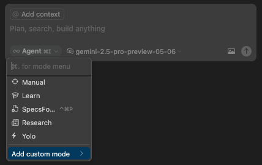
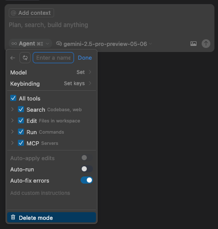

# 🚀 Introduction to Custom Modes

> **🔑 Key Takeaways:**
> 
> - **Create AI Personas:** Custom Modes are like saved "personas" for the AI, each with its own specific instructions and expertise.
> - **Efficiency is the Goal:** Avoid re-typing long, repetitive instructions by saving them as a mode you can activate with a click.
> - **System Prompt is Core:** The main part of a Custom Mode is the "system prompt," which tells the AI how to behave (e.g., "You are an expert tutor...").
> - **Easy to Set Up:** Create and manage modes through Cursor's settings UI.

---

Cursor Custom Modes allow you to create specialized "personas" or "experts" within the AI. This lets you quickly switch between different AI behaviors tailored for specific tasks, like learning a new concept or drafting documentation.

## ✨ Why Use Custom Modes?

-   **Efficiency:** Instead of re-typing long instructions for common tasks, activate a mode with one click.
-   **Consistency:** Ensure the AI approaches specific tasks in a consistent way every time.
-   **Specialization:** Create expert AI assistants for different domains (e.g., a "Documentation Writer" mode or a "Code Refactoring" mode).
-   **Focus:** Help the AI stay on task by defining its scope and available tools.

## 🛠️ How to Set Up a Custom Mode

The process is straightforward and handled through Cursor's UI.

1.  **Navigate to Custom Modes:** Find the "Custom Modes" or "Agent Modes" section in Cursor's settings.  
    

2.  **Create a New Mode:** Click the "Create New Mode" button.  
    

3.  **Configure the Mode:**
    *   **Name:** Give it a clear, descriptive name (e.g., "Learn Mode").
    *   **System Prompt:** This is the most important part. Write instructions that define the mode's behavior. Start with a clear role, like "You are an expert tutor..."
    *   **Tools:** Select which tools (like Web Search or File Edits) the mode should have access to.  
    

4.  **Save and Activate:** Save the mode, and it will be available to select in your chat panel.

    *   Once saved, your new mode will appear in the chat input's model selector.

In the following sections, we'll explore concrete examples of useful custom modes.

---

[⬅️ Back to Custom Modes Overview](./README.md) | [Up: Custom Modes](../README.md) | [Next: Mode Spotlight: Learn ➡️](./04b-Mode-Spotlight-Learn.md)
