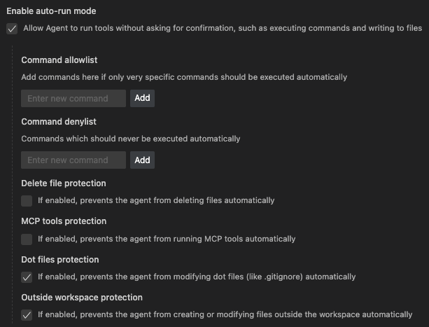

# 05. Essential Cursor Settings for a Vibe-Driven Experience

Cursor offers a range of settings to fine-tune your AI-assisted workflow. Enabling a few key options, especially some of the innovative BETA features, can significantly enhance your productivity and align with a more fluid, "vibe-driven" approach to development and documentation.

---

## 1. Include project structure (BETA)

This setting is a game-changer for ensuring your AI assistant always has the necessary context about your project's layout.

-   **What it is (as per Cursor settings):** "Include project structure (BETA) - Include a simplified directory tree to give the model a sense of your codebase layout."
-   **Why it's crucial:**
    *   **Contextual Awareness:** Automatically prepends the current repository's file tree to the model's context.
    *   **Accuracy:** Helps the AI understand file locations and relationships, leading to more accurate suggestions and code generation.
    *   **Efficiency:** Reduces the need to manually remind the AI about your project's structure using `@` mentions for every file.
-   **Recommendation:** Enable this to keep your AI consistently informed.

    

---

## 2. Enable auto-run mode

For those who want to fully embrace the "vibe" and work at speed, this setting streamlines the interaction with Cursor's agent capabilities.

-   **What it is (as per Cursor settings):** "Enable auto-run mode - Allow Agent to run tools without asking for confirmation, such as executing commands and writing to files."
-   **Why it's recommended (for the brave and vibey):**
    *   **Speed:** The AI can execute necessary steps (like running terminal commands or applying file edits) without pausing for your approval each time.
    *   **Flow:** Maintains a smoother workflow when you're confident in the AI's direction.
    *   **Embrace the Vibes:** This is for users comfortable with letting the AI take more initiative.
-   **Recommendation:** Consider enabling this if you're looking for maximum efficiency and trust in the AI's actions, but be mindful that it grants more autonomy.

    

---

## 3. Play sound on finish (BETA)

A small but satisfying feature that adds a touch of positive reinforcement to your workflow.

-   **What it is (as per Cursor settings):** "Play sound on finish (BETA) - Play a sound when a chat response is completed."
-   **Why it's nice:**
    *   **Auditory Cue:** Lets you know when a potentially longer AI operation has finished without needing to constantly watch the screen.
    *   **Dopamine Hits:** As I like to put it, "It just releases nice little amounts of dopamine when the vibe coding is progressing!"
-   **Recommendation:** Enable this for a pleasant and informative auditory feedback loop.

    

---

## 4. Web Search Tool (BETA)

Empower your AI assistant with real-time information from the internet.

-   **What it is (as per Cursor settings):** "Web Search Tool (BETA) - This will allow chat in agent/ask mode to search the web for information."
-   **Why it's essential:**
    *   **Up-to-Date Information:** Allows the AI to access current documentation, latest API changes, or contemporary articles.
    *   **Broader Knowledge:** Expands the AI's knowledge base beyond its training data.
    *   **Research Power:** Turns your chat into a powerful research assistant.
-   **Recommendation:** Definitely enable this to give your AI the broadest possible context and information access.

    

---

## Other Settings to Explore

Once you're comfortable with these, delve into other settings Cursor offers:

-   **Theme and Appearance:** Customize the visual environment.
-   **Keybindings:** Tailor shortcuts to your habits.
-   **AI Model Preferences:** Set default models (as discussed in "Choosing Your AI Model").
-   **Privacy and Data Settings:** Understand and configure data handling.

By thoughtfully configuring these settings, especially the BETA features, you can create a highly efficient, context-aware, and enjoyable working environment in Cursor. Remember to check the settings panel as new Cursor versions are released to discover new features and customization options. 