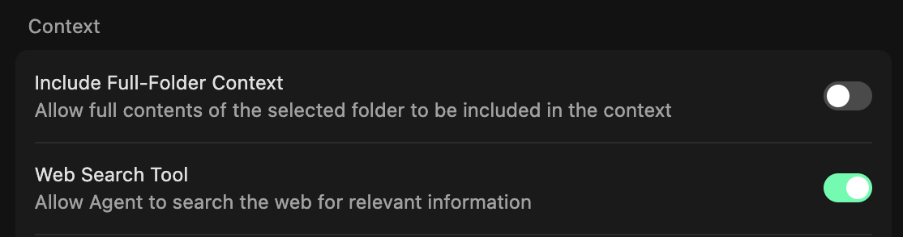
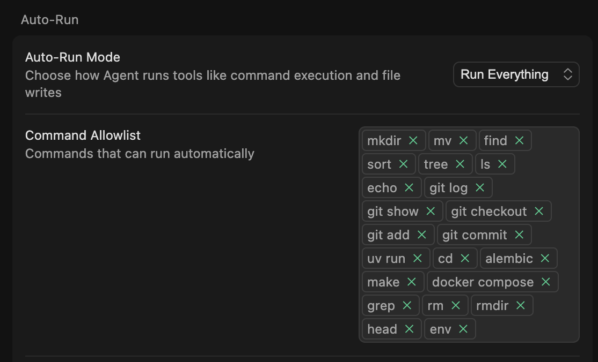

# ⚙️ Essential Cursor Settings

> **🔑 Key Takeaways:**
> 
> - **Enable `Include project structure`:** This is the most important setting. It gives the AI a file tree of your project, massively improving its context and accuracy.
> - **Enable `Web Search Tool`:** Allows the AI to access up-to-date information from the internet, crucial for research and current best practices.
> - **Enable `Auto-run mode` for Speed:** For advanced users, this allows the AI to execute commands and edits without confirmation, creating a faster workflow.
> - **Enable `Play sound on finish` for Feedback:** A simple but effective auditory cue that an AI task is complete.

---

To get the most out of Cursor, you should enable a few key settings. These options, especially the BETA features, will significantly enhance your productivity.

### 1. Include project structure (BETA)

**This is a game-changer. Enable it.** It gives the AI a simplified directory tree of your project, so it always understands your codebase layout.

-   **Why it's crucial:** Improves contextual awareness and accuracy, reducing the need for you to manually reference files.  
    

### 2. Web Search Tool (BETA)

**Enable this for a smarter AI.** It allows the agent to search the web for real-time information.

-   **Why it's essential:** Gives the AI access to current documentation, APIs, and articles beyond its training data.  
    

### 3. Enable auto-run mode

For users who want to work at maximum speed and are comfortable with the AI taking initiative.

-   **Why it's powerful:** The AI can execute terminal commands and apply file edits without pausing for your approval, creating a much smoother workflow. Use with confidence!  
    

### 4. Play sound on finish (BETA)

A small but satisfying feature for positive reinforcement.

-   **Why it's nice:** Provides a clear auditory cue when a task is complete, so you don't have to keep checking the screen.  
    

---

By thoughtfully configuring these settings, you can create a highly efficient and context-aware working environment in Cursor.

---

[⬅️ Back to Custom Modes](./04-Custom-Modes-Tailoring-Cursor-to-You/README.md) | [Up: Cursor for Everyone](../README.md) | [Next: The MCP ➡️](./06-The-Model-Context-Protocol-MCP/README.md) 