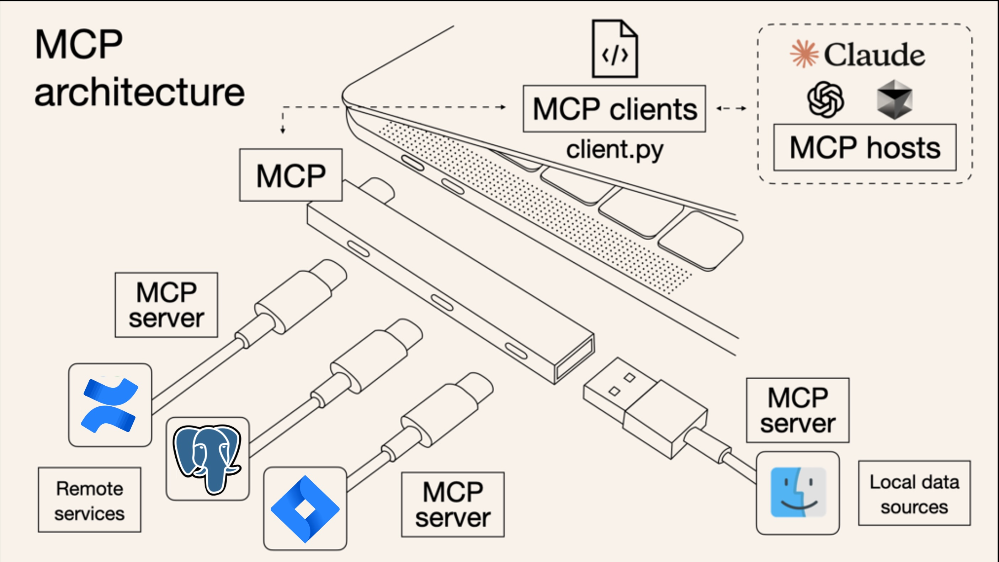

# 🌍 MCP: The Big Picture

> **🔑 Key Takeaways:**
> 
> - **Connects Cursor to Your Tools:** The Model Context Protocol (MCP) lets Cursor talk to external services like Jira, Confluence, and databases.
> - **Richer Context:** It dramatically expands the AI's awareness beyond your local code, allowing it to pull in issue details, documentation, and more.
> - **Streamlined Workflows:** MCP enables you to perform actions in other tools (like commenting on a Jira ticket) directly from Cursor.
> - **Setup is Per-Service:** You typically authenticate each tool once using an API key or OAuth.

---

The Model Context Protocol (MCP) is a system that connects Cursor to the external tools you use every day. It's a game-changer for providing the AI with deep, real-time context about your projects.

*Image source: [Composio Blog](https://composio.dev/blog/what-is-model-context-protocol-mcp-explained/)*

## 🤔 What Does MCP Do?

-   **Accesses External Data:** Reads information from connected services (e.g., retrieves a Jira issue).
-   **Enriches AI Context:** Feeds this external information to the AI, making its responses far more relevant.
-   **Performs Actions:** With your permission, it can make changes in external systems (e.g., adds a comment to a Jira issue).

Think of MCP as giving Cursor API access to your other platforms, with you in control.

## ✨ Why is MCP Important?

-   **Reduces Tab-Switching:** Bring critical project information directly into your editor.
-   **Deeper AI Understanding:** The AI can see the *why* behind the code by accessing the associated Jira ticket or Confluence page.
-   **Automates Routine Tasks:** Streamline workflows that span multiple tools, like fetching ticket details, drafting code, and adding a progress comment.

## ⚙️ How It Works

1.  **Connectors:** MCP uses tool-specific "connectors" (e.g., a Jira connector).
2.  **Authentication:** You set up each connector by authenticating with the service, typically using an API token or OAuth. This is a one-time setup.
3.  **Commands:** Once connected, you use natural language or special commands (`@jira get issue...`) to interact with the service through Cursor.

In the next sections, we'll see practical examples with popular tools.

---

[⬅️ Back to MCP Overview](./README.md) | [Up: Cursor for Everyone](../../README.md) | [Next: MCP in Action ➡️](./06b-MCP-in-Action-Jira-and-Confluence.md) 