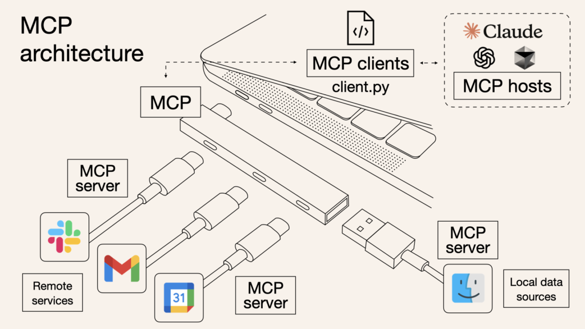

# The Multi-Connector Platform (MCP): Bridging Cursor with Your Tools

The Multi-Connector Platform (MCP) is a powerful Cursor feature that allows the AI to connect directly to external tools and services you already use. This dramatically expands Cursor's contextual understanding and ability to interact with your broader work ecosystem, like project management systems (Jira), documentation platforms (Confluence), and potentially many others.

## What is MCP?

*Image source: [Composio Blog](https://composio.dev/blog/what-is-model-context-protocol-mcp-explained/)*

At its core, MCP enables Cursor to:

-   **Access External Data:** Read information from connected services (e.g., retrieve issue details from Jira, fetch page content from Confluence).
-   **Perform Actions (with permission):** In some cases, and always with user approval for actions, MCP can allow Cursor to make changes in external systems (e.g., add a comment to a Jira issue, create a new Confluence page).

-   **Enrich Context:** Seamlessly bring relevant information from these external sources directly into your Cursor chat and AI workflows, providing richer context than just your local codebase.

Think of it as giving Cursor API access to your other tools, with you in control.

## Why is MCP a Game-Changer?

-   **Centralized Information Access:** No more constant tab-switching. Bring critical project information directly into your development environment.
-   **Enhanced AI Understanding:** When Cursor can see Jira ticket details or relevant Confluence pages, its suggestions, code, and explanations become far more relevant to your actual project tasks.
-   **Streamlined Workflows:** Automate routine tasks that span multiple tools. For example, get details for a Jira ticket, draft a code solution, and then add a comment back to the ticket, all facilitated through Cursor.
-   **Improved Collaboration (Indirectly):** By having better context from shared tools, the AI can help generate code or documentation that is more aligned with team activities and knowledge bases.

## How MCP Works (General Concept)

1.  **Connectors:** MCP uses "connectors" (sometimes called "MCP Servers" or plugins) that are specific to each external tool (e.g., a Jira connector, a Confluence connector).
2.  **Authentication & Authorization:** You'll typically need to authenticate Cursor with the external service (e.g., using API tokens or OAuth). This is a one-time setup per service and grants Cursor permission to access data on your behalf, respecting your user permissions in that external tool.
3.  **MCP Commands/Queries:** Once connected, you can use special commands or natural language queries in Cursor to interact with the service. For example:
    *   `@jira get issue PROJ-123`
    *   `@confluence search for "API documentation" in SPACEKEY`
    *   Or more naturally: "What are the details for Jira ticket PROJ-123?" or "Find the Confluence page about our API documentation in the DEV space."
4.  **Data Exchange:** Cursor communicates with the external tool via the connector, sending your request and receiving data back, which is then presented to you or used by the AI.

## Setting Up MCP Integrations (General Steps)

While the specific steps vary for each service:

1.  **Locate MCP Settings:** Find the MCP or Integrations section within Cursor's settings.
2.  **Select the Service:** Choose the service you want to connect (e.g., Jira, Confluence).
3.  **Follow Authentication Prompts:** Cursor will guide you through the authentication process. This might involve:
    *   Providing your instance URL (e.g., `yourcompany.atlassian.net`).
    *   Creating an API token in the external service and pasting it into Cursor.
    *   Going through an OAuth flow where you grant Cursor permissions.
4.  **Test the Connection:** Once set up, try a simple query to ensure the connection is working.

**Security Note:** Always be mindful of the permissions you grant. MCP is designed to respect your credentials, but it's good practice to use the principle of least privilege (granting only necessary permissions) when creating API tokens if possible.

In the next sections, we'll look at specific examples of using MCP with Jira and Confluence, and discuss the broader ecosystem of potential MCP integrations. 