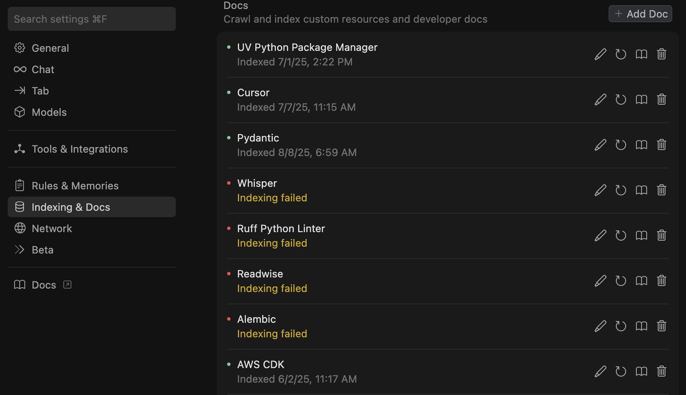

# 📄 Mastering the @Docs Feature

> **🔑 Key Takeaways:**
> 
> - **Provide Authoritative Context:** `@Docs` is crucial for developers because it points the AI to the *exact* documentation for the libraries and frameworks you are using, overcoming the AI's knowledge cutoff.
> - **The Core Workflow:** 1) Find the official docs URL for your library (e.g., `https://fastapi.tiangolo.com/`). 2) Add it in Cursor Settings with a memorable name (e.g., "FastAPI Docs"). 3) Reference it in chat with `@Docs FastAPI Docs` before asking your question.
> - **Be Specific in Your Prompts:** After referencing the docs, explicitly tell the AI to use them: "Using the FastAPI docs I provided, show me how to..."
> - **Combine with Rules:** Use `@Docs` to provide context when asking the AI to help you write new Cursor Rules for your tech stack.

---

For developers, `@Docs` is a superpower. It allows you to ground the AI in the specific, authoritative documentation for your project's tech stack, leading to more accurate, up-to-date, and reliable code generation.

## Why It's Essential for Developers

-   **Beats Knowledge Cutoffs:** The AI's training data is not always current. `@Docs` ensures it uses the latest version of a library's API.
-   **Prevents Deprecated Code:** By pointing to official docs, you stop the AI from suggesting outdated functions or patterns.
-   **Enforces Best Practices:** Ensures the AI follows the specific conventions and security guidelines outlined in the official documentation.

## A Practical Workflow

Here is a step-by-step example for working with a new library, like `Plotly Express`.

1.  **Find the Official Docs:** A quick web search leads you to `https://plotly.com/python/plotly-express/`.

2.  **Add the Source in Settings:**
    -   Navigate to Cursor Settings → `Docs`.
    -   Click "Add" and provide a name and the URL:
        -   **Name:** `Plotly Express`
        -   **URL:** `https://plotly.com/python/plotly-express/`
    

3.  **Use it in Chat:**
    -   First, provide the context: `@Docs Plotly Express`
    -   Then, ask your specific question, reminding the AI to use the context:
        > "Using the Plotly Express documentation, show me a simple example of how to create a scatter plot from a Pandas DataFrame."
    -   Follow up with more detailed requests:
        > "Based on those same docs, how do I customize the chart's title and colors?"

This simple but powerful workflow ensures the AI's suggestions are directly relevant to the technology you're actively using.

## Advanced Strategy: Combining `@Docs` and Rules

You can create incredibly powerful, tech-stack-specific guidance by using `@Docs` to help you write new Cursor Rules. For a detailed guide on this, see [Auto-Generating Rules from Docs](./02-Crafting-Rules-for-Your-Tech-Stack/02b-Auto-Generating-Rules-from-Docs.md).

---

### Sources

- Concepts (@Docs, context): https://docs.cursor.com/get-started/concepts
- Changelog (PDF parsing/@link & chat rendering): https://cursor.com/changelog

[⬅️ Back to Manifesto](./00-The-Vibe-Programmer-Manifesto.md) | [Up: Cursor for Developers](./README.md) | [Next: Crafting Rules ➡️](./02-Crafting-Rules-for-Your-Tech-Stack/README.md) 
