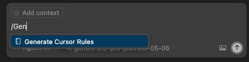

# 🤖 Auto-Generating Rules from @Docs

> **🔑 Key Takeaways:**
> 
> - **Use Docs to Write Rules:** This is a power-user workflow. You can point the AI to official documentation using `@Docs` and then ask it to write a new Cursor Rule based on that documentation.
> - **A Simple, Repeatable Process:** 1) Add docs URL to settings. 2) Reference it in chat with `@Docs`. 3) Ask the AI to draft a new rule based on that context.
> - **Incorporate Master Rules:** For ultimate consistency, when asking the AI to generate a new rule, also `@` mention your foundational rule-writing guidelines (e.g., `@.cursor/rules/01-mdc-guidelines.mdc`).
> - **Result: High-Quality, Fast Rules:** This semi-automated process dramatically speeds up the creation of high-quality, tech-specific rules grounded in authoritative sources.

---

Manually writing comprehensive rules for every library in your tech stack is time-consuming. A more powerful approach is to have Cursor do it for you, using the official documentation as a source of truth.

## The Workflow: From Docs to Rules

This process combines `@Docs` with rule generation to create a fast and effective feedback loop.

### Step 1: Add Documentation to Cursor
In Cursor Settings, go to the `Docs` section and add the official documentation URL for the library you want a rule for. Give it a memorable name.

-   **Name:** `FastAPI Docs`
-   **URL:** `https://fastapi.tiangolo.com/`

### Step 2: Prompt for Rule Generation Using `@Docs`
Now, construct a prompt that does two things:
1.  References the documentation you just added using `@Docs`.
2.  Asks the AI to generate a new rule file.

For ultimate consistency, you should also `@` mention your own "master rule" for how rules should be written, like `01-mdc-guidelines.mdc`.



Here is the prompt used in the image above:
```plaintext
@Docs FastAPI Docs
@.cursor/rules/01-mdc-guidelines.mdc

Based on the context from the official FastAPI documentation and my own rule-writing guidelines, please generate a new, comprehensive Cursor Rule.

The rule should be named `aws-cdk-python-library-best-practices.mdc` and should be saved in the `.cursor/rules/` directory.

The rule should cover key best practices for writing pythonic aws cdk code, including project structure, stack organization, construct patterns, and testing. Ensure the rule is well-structured, clear, and provides code examples for each best practice.
```

### Step 3: Refine and Save
The AI will generate a draft of the new rule. Review it, make any necessary adjustments to fit your project's specific needs, and save it. You have now created a high-quality, tech-specific rule in a fraction of the time it would have taken to write manually.

---

[⬅️ Back to Why Rules Matter](./02a-Why-Tech-Specific-Rules-Matter.md) | [Up: Cursor for Developers](../README.md) | [Next: Evolving Your Ruleset ➡️](./02c-Evolving-Your-Ruleset.md) 